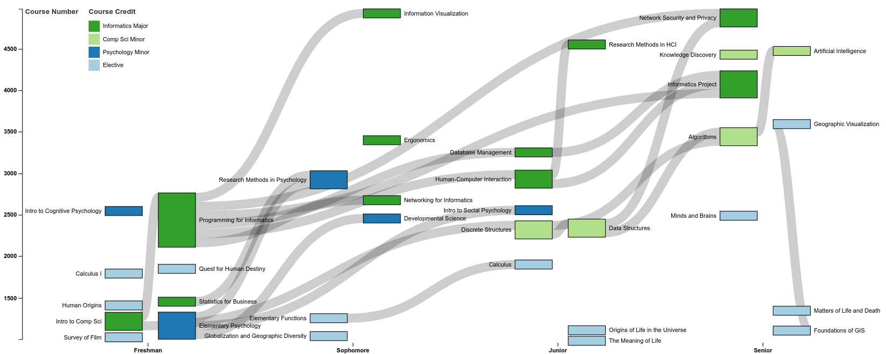

# College Sankey

A Sankey diagram of my college courses, using my classes as nodes and class prerequisites as links. Created using [D3.js](https://github.com/d3/d3), the [D3-Sankey plugin](https://github.com/d3/d3-sankey), and [Colorbrewer](http://colorbrewer2.org).

</img>

#### **Unfinished work**

- [x] Layout classes by specified X, Y positioning.
- [x] Color Classes by credits.
- [ ] Adjust Node X height via force simulation/bounding box to prevent overlaps.
- [ ] Adjust labels so there's less overlap.
- [ ] Node alignment, general neatness, etc.
