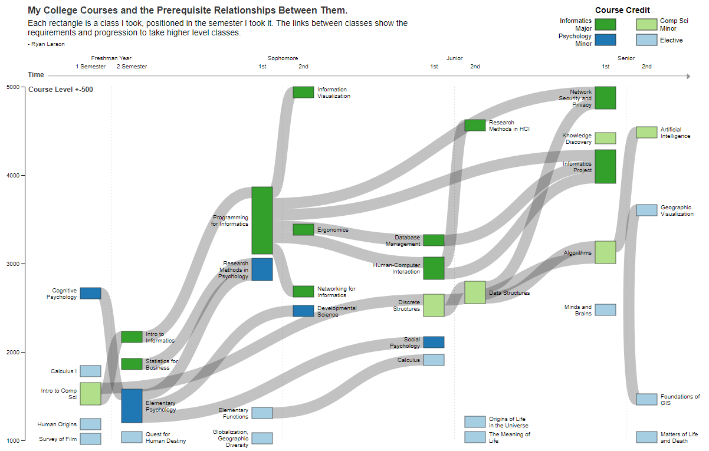

# College Sankey

A Sankey diagram of my college courses, using my classes as nodes and class prerequisites as links. Created using [D3.js](https://github.com/d3/d3), the [D3-Sankey plugin](https://github.com/d3/d3-sankey), and [Colorbrewer](http://colorbrewer2.org).

</img>

#### **Unfinished work**

- [x] Layout classes by specified X, Y positioning.
- [x] Color Classes by credits.
- [x] Move X axis ticks rightward for more natural labeling.
- [x] Adjust Node X height via force simulation/bounding box to prevent overlaps.
  * See below for details.
- [x] Adjust labels so there's less overlap.
- [x] Node alignment, general neatness, etc.
- [ ] HTML formatting
- [ ] Proper introduction and explanation of the chart.

### Changed courses

For transparency, here is a list of the altered courses. I altered their Y-Position to prevent overlapping, otherwise large portions of the chart were a hot mess.

| Original Class | New Y-Position |
|---|---|
| CINE:1260| 1080 |
| ANTH:1301| 1460 |
| MATH:1020| 1200 |
| ANTH:1061| 1161 |
| STAT:1030| 1400 |
| CS:2520| 2820 |
